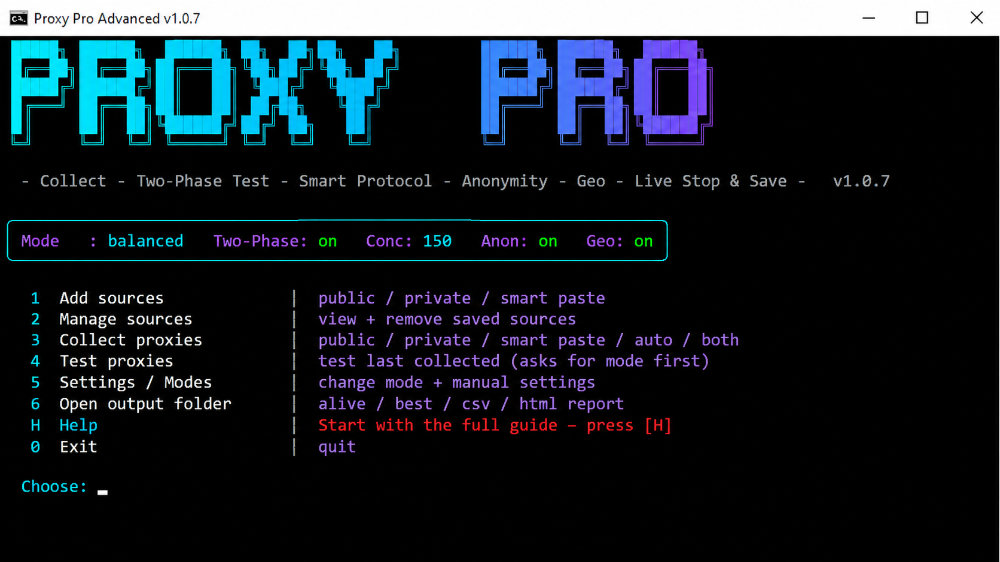

<div align="center">



<br>

# 🛡️ Proxy Pro Advanced

**All-in-one proxy collector, tester and sorter — Smart • Fast • Modern**


<br>

[](https://github.com/NetScanner-X/Proxy-Checker/releases/latest)

<br>

*Collect from any source • Two-Phase testing • Protocol / Anonymity / Country detection • Auth proxies fully supported*

</div>

---

## ✨ What is Proxy Pro Advanced?

**Proxy Pro Advanced** is a professional command-line tool that turns raw proxy links into a **clean, tested, sorted and ready-to-use** list.

Give it URLs, local files, folders or pasted text. It can collect and deduplicate proxies, perform TCP pre-checks, test protocols, measure latency, detect anonymity level and location, and save the results in organized folders without overwriting previous runs.

> Works on Windows, macOS and Linux. No account. No cloud processing. Everything runs locally on your device.

---

## 🚀 Highlights

| Feature | What it does |
|---|---|
| 🧠 **Smart Collector** | Collects proxies from URLs, files, folders or pasted text, including `ip:port` and `ip:port:user:pass` |
| 🔒 **Private Sources** | Keeps credential-based sources isolated from public and automatic sources |
| ⚡ **Two-Phase Testing** | Phase 1 checks TCP reachability; Phase 2 performs full protocol testing |
| 🌐 **Protocol Detection** | Detects and separates HTTP, HTTPS, SOCKS4 and SOCKS5 proxies |
| 🕵️ **Anonymity Check** | Identifies Transparent, Anonymous and Elite proxies |
| 🌍 **Geo Lookup** | Detects the country and ISP of each proxy |
| 🔑 **Authenticated Proxies** | Preserves complete `username:password` credentials in dedicated output files |
| 💾 **Numbered History** | Creates a new Collect/Test folder for every run, so previous results are never overwritten |
| ▶️ **Resume Support** | Stop with `Q` or `Ctrl+C` and continue later from the last saved point |
| 🎨 **Modern Terminal UI** | Colored panels, live progress and a purple/cyan status bar |

---

## 📦 Installation

### 1️⃣ Install Node.js

Download and install **Node.js 18 or newer** from [nodejs.org](https://nodejs.org).

### 2️⃣ Download the tool

Download the latest ZIP package from the [Releases](../../releases) page and extract it to any folder.

### 3️⃣ Install dependencies

**Windows**

Double-click:

```text
INSTALL_FIRST.bat
```

**macOS / Linux**

```bash
npm install
```

### 4️⃣ Run the tool

**Windows**

Double-click:

```text
RUN.bat
```

**macOS / Linux**

```bash
node proxy-pro.js
```

---

## 🎛️ Main Menu

The live status bar at the top shows the current configuration:

```text
Mode : balanced   Two-Phase: on   Conc: 150   Anon: on   Geo: on
```

| Key | Action | What it does |
|:---:|---|---|
| `1` | **Add sources** | Add Public, Private or Smart Paste sources |
| `2` | **Manage sources** | View and remove saved sources |
| `3` | **Collect proxies** | Collect from Public, Private, Smart Paste, Auto or Both |
| `4` | **Test proxies** | Test the most recently collected list |
| `5` | **Settings / Modes** | Change the testing mode and manual settings |
| `6` | **Open output folder** | Open alive, best, CSV or HTML report folders |
| `H` | **Help** | Open the complete in-app guide |
| `0` | **Exit** | Close the tool safely |

---

## ➕ Add Sources — Menu 1

| Key | Type | Description |
|:---:|---|---|
| `1` | **Public** | URLs or local files without credentials |
| `2` | **Private** | A URL or file with a `username:password` pair assigned to the source |
| `3` | **Smart Paste** | Paste URLs, file paths, `ip:port` or `ip:port:user:pass`; the tool routes them automatically |
| `0` | **Back** | Return to the main menu |

You can drag and drop multiple files or an entire folder. Supported source files include `.txt`, `.list` and `.csv`.

---

## 📥 Collect Proxies — Menu 3

| Key | Source | Notes |
|:---:|---|---|
| `1` | **Public sources** | Uses only sources added through Add Sources → Public |
| `2` | **Private sources** | Uses only credential-based private sources |
| `3` | **Smart Paste** | Uses only proxies added through Smart Paste |
| `4` | **Auto — Built-in** | Uses the built-in default source list |
| `5` | **Both — Merged** | Combines Public, Smart Paste and built-in sources; Private sources are intentionally excluded |
| `0` | **Back** | Return to the main menu |

> Private sources are always processed separately through option `2`.

---

## 🧪 Test Proxies — Menu 4

Before every test run, choose how the testing mode should be selected:

| Key | Choice |
|:---:|---|
| `1` | Use the current mode selected in Settings |
| `2` | Let the tool automatically select a mode based on list size |
| `3` | Choose one of the available testing modes manually |
| `0` | Cancel |

### Testing Modes

| Mode | Best for | Concurrency | Highlights |
|---|---|:---:|---|
| **ultra** | Lists with 100,000+ proxies | 400 | Maximum speed, anonymity and geo checks disabled |
| **fast** | Large lists | 250 | One endpoint plus geo lookup |
| **balanced** ⭐ | General use and default testing | 150 | Two endpoints, anonymity and geo checks |
| **accurate** | Quality-focused testing | 80 | Three endpoints and double-checking |
| **deep** | Reducing false-dead results | 50 | Eight endpoints with judge revalidation |
| **strict** | Keeping only top-quality proxies | 60 | Very strict thresholds |
| **lowpc** | Low-end computers or slow connections | 30 | Lightweight testing |
| **sample** | Quick verification | 120 | Tests only the first 1,000 proxies |

Press `Q` or `Ctrl+C` at any time. Partial results are saved and can be resumed later.

---

## 📁 Output Layout

Previous runs are never overwritten.

```text
output/
├── All_proxy/
│   └── All_proxy_N/
│       ├── all_proxies.txt
│       ├── ip_port_only.txt
│       ├── http.txt
│       ├── https.txt
│       ├── socks4.txt
│       ├── socks5.txt
│       ├── unknown.txt
│       └── collect_summary.txt
└── Result_test/
    └── results_N/
        ├── alive.txt
        ├── alive_with_auth.txt
        ├── best.txt
        ├── elite.txt
        ├── dead.txt
        ├── results.csv
        ├── summary.txt
        ├── tested_results.json
        ├── report.html
        ├── by_type/
        └── by_country/
```

### Important Output Files

- `alive.txt` — Working proxies without authentication, sorted from best to worst
- `alive_with_auth.txt` — Working proxies with complete authentication credentials
- `best.txt` and `elite.txt` — Top-quality proxies
- `dead.txt` — Failed proxies
- `results.csv` — Structured test results
- `report.html` — Browser-friendly HTML report
- `by_type/` — Results separated by protocol
- `by_country/` — Results separated by country

> `alive_with_auth.txt` stores the complete `username:password` value in plain text on your own device. Protect this file if it contains private credentials.

---

## 🩺 Troubleshooting

<details>
<summary><b>The menu does not respond when I press a number</b></summary>

This issue was fixed in **v1.0.7**. If it still occurs, run the tool from `cmd.exe` or Windows Terminal rather than another wrapper, and press Enter after entering your selection.

</details>

<details>
<summary><b>Does Auto Collect use my private proxies?</b></summary>

No. Since **v1.0.5**, Auto and Both do not access Private sources. Use option `2` in the Collect menu to process Private sources separately.

</details>

<details>
<summary><b>All proxies are reported as dead</b></summary>

Try the `deep` or `accurate` mode, verify your internet or VPN connection, and check the test endpoints in Settings.

</details>

<details>
<summary><b>Windows blocks a BAT file</b></summary>

Make sure the project was downloaded from the official repository. You can inspect the `.bat` files in a text editor before running them. If Windows SmartScreen appears, review the warning and continue only if you trust the downloaded files.

</details>

---

## 🔐 Privacy and Security

- The tool runs locally on your device.
- Proxy lists are not uploaded to a cloud service by this project.
- Private proxy credentials remain in your local files.
- Always review unknown proxy sources before using them.
- Do not publish output files containing private credentials.

---

## 💬 Contact

Questions, bug reports, feedback or feature ideas?

Contact the developer on Telegram:

[](https://t.me/Hunter23_S)

---

<div align="center">

## ⭐ Support the Project

If **Proxy Pro Advanced** is useful to you, please give the repository a Star and share it with others.

Your support helps the project grow and reach more users.

[](https://github.com/NetScanner-X/Proxy-Checker)

</div>

---

## 📄 License

This project is licensed under the [MIT License](./LICENSE).
